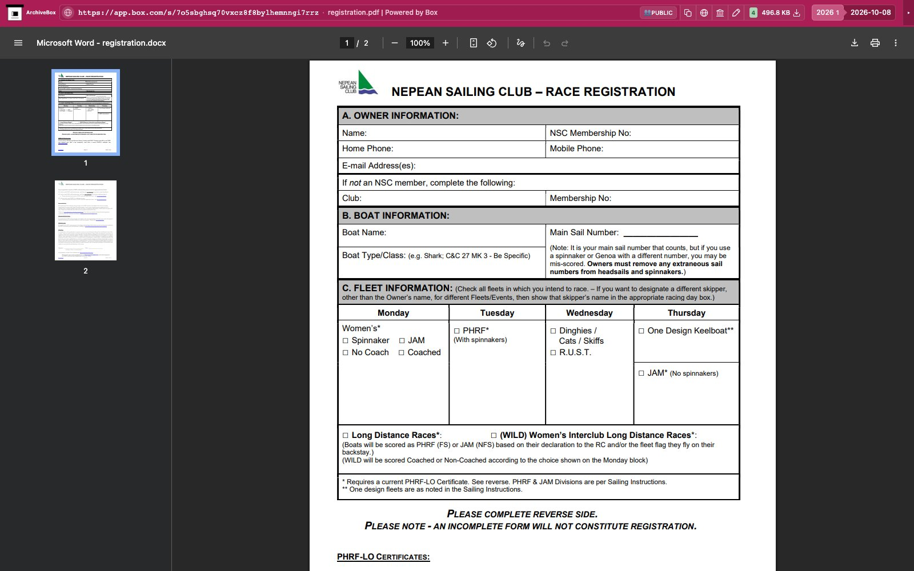

# Box

Downloads Box public file and folder shares with the provider's Download control in the
snapshot's existing Chrome tab. One snapshot hook attaches to the existing page;
unrelated pages return `noresults` without provider requests or selector waits.
No OAuth, API key, new browser, or extra packages are required.

Outputs are `downloads.json` and original files under `files/`. The manifest
records filenames, sizes, and SHA-256 hashes; the embedded-media stack uses the
stock file explorer. Enabled by default. Settings are `BOX_ENABLED` and `BOX_TIMEOUT` (120 seconds,
with the shared `TIMEOUT` fallback). Download permissions and bandwidth limits
apply. Protected shares need an already authorized browser session.

The real public fixture is Nepean Sailing Club's
[registration.pdf](https://app.box.com/s/7o5sbghsq70vxcz8f8bylhemnngi7rrz), published
by its [Box version history tutorial](https://nsc.ca/an/boating/know-how/how-to-use-box/using-box-version-feature/).

Run `uv run pytest -xq abx_plugins/plugins/box/tests`. Public file downloads are
verified. Folder downloads are CRC-checked and unpacked. The official public
[Box logo SVG folder](https://app.box.com/s/9h9dfu6nbfskj4p64gal20xuf7d7f635),
linked by [Chalk branding guidelines](https://chalkdesignsystem.com/branding/),
is verified to produce its 30 individual logos.

Real public capture replayed through ArchiveBox's normal file browser:

[Tablet](tests/replay-tablet.jpg) · [Mobile](tests/replay-mobile.jpg).

The hook attaches to Chrome before checking original/current document URLs and
waiting for navigation. Ordinary provider homepages return `noresults` without
provider selector waits or downloads. Identifiable document navigation and
export errors remain `failed`.
Explicit Box share redirects to recognized account login pages return `skipped`.
