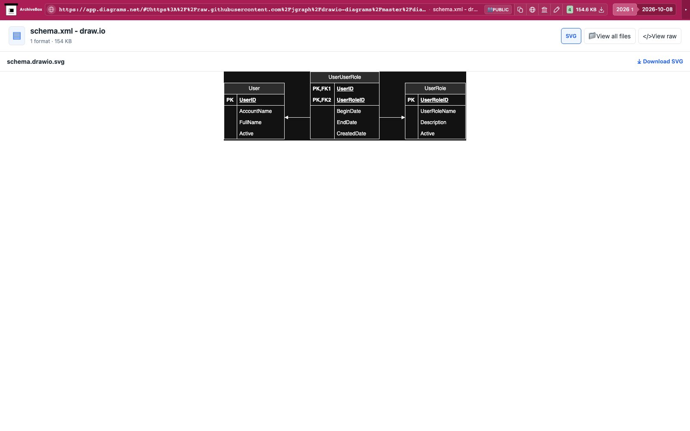

# draw.io

Exports a shared draw.io / diagrams.net editor document as SVG with the editable
diagram embedded. The hook uses File → Export as → SVG in the existing Chrome
tab, keeps “Include a copy of my diagram” enabled, and downloads locally.
It does not edit or save the source document remotely.

Uses the existing Chrome download helper and `saveDownloads` without additional
dependencies. `downloads.json` records the saved SVG's path, size and SHA-256.
The embedded-media stack opens the saved SVG preview.
One snapshot hook checks applicability and returns `noresults` immediately for
unrelated settled pages.

Settings (enabled by default): `DRAWIO_ENABLED` and `DRAWIO_TIMEOUT` (120 seconds, with `TIMEOUT`
fallback). The initial export surface is shared editor URLs on app.diagrams.net
and app.draw.io with a document location hash (`G`, `W`, `T`, `D`, `A`, `H`,
`R`, or a valid HTTP(S) `U` source). Arbitrary anchors, browser-local files,
editor configuration links, and lightbox-only viewers are not covered.

The live fixture is draw.io's official public schema.xml example. The test
checks its UserRole and AccountName content and embedded mxfile source.
Run `uv run pytest -xq abx_plugins/plugins/drawio/tests` in this repository.

Real public capture replayed through ArchiveBox's normal file browser:

[Tablet](tests/replay-tablet.jpg) · [Mobile](tests/replay-mobile.jpg).

ArchiveBox previews the saved SVG directly and keeps the editable SVG available through Download. Nested collections or duplicate formats use the file explorer.
