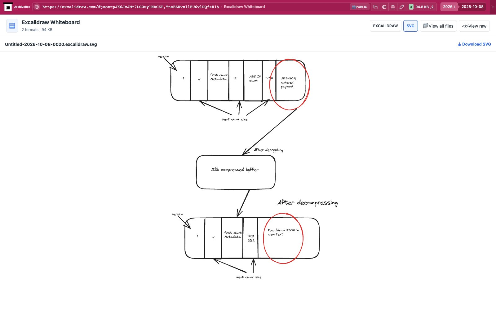

# Excalidraw

Export the loaded scene as editable `.excalidraw` JSON and an SVG with its scene embedded. The public encrypted share is loaded and decrypted by the provider before export; the hook uses the real Save to file and Export to SVG controls.

Provider documentation: [Excalidraw exports](https://docs.excalidraw.com/docs/codebase/json-schema/).

ArchiveBox-managed Chrome disables `FileSystemAccessLocal` by default so
Excalidraw uses its official browser-download fallback. Chrome's native save
picker cannot complete an unattended headless export or emit a browser download
event. No additional configuration is needed for managed Chrome. An externally
attached browser must also launch with
`--disable-blink-features=FileSystemAccessLocal`; the hook reports an actionable
error if native save pickers remain enabled. The hook does not modify browser
APIs or the application.

The hook attaches to the snapshot's existing Chrome target. It uses the browser's
current session and never launches a browser, opens a tab, navigates, or asks for
API keys. Saved shared scenes use `#json=` links. Live `#room=` sessions return
`noresults`: a retained room URL does not prove that collaboration has finished
synchronizing, so exporting it could save an incomplete scene. When the provider removes
a JSON share fragment, the hook requires a matching successful provider request
in the current document's resource timing before exporting. The original URL
alone cannot authorize exporting a previous local scene after a canceled import.
Other pages, including the empty homepage, return `noresults` after attachment.

If the persona already has a local scene, Excalidraw may ask before replacing it.
The hook fails promptly and preserves that scene and its confirmation dialog;
it never accepts the overwrite. Resolve the provider's import in the existing
browser before capturing again. Visible import-error dialogs also fail capture.

`EXCALIDRAW_ENABLED` defaults to true; set it false to disable extraction.
`EXCALIDRAW_TIMEOUT` bounds the operation (120 seconds, with `TIMEOUT` fallback). Outputs are ordinary files under
`excalidraw/files/`; `downloads.json` records relative paths, formats, sizes, and
SHA-256 hashes. ArchiveBox offers format buttons and direct previews.

Run through the normal capture lifecycle:

```bash
uv run abx-dl dl --plugins=excalidraw 'https://excalidraw.com/#json=pJK6JcJMr7LGOuy1NbCKP,YneEARvxllEU6vlDQfz81A'
```

Tests call the real Chrome crawl, tab, navigation and snapshot hooks against
public URLs. See `tests/RESULTS.md` for the actual evidence and limitations.

Real public capture replayed through ArchiveBox's normal file browser:



[Tablet](tests/replay-tablet.jpg) · [Mobile](tests/replay-mobile.jpg).

ArchiveBox offers native scene and SVG format buttons. The saved SVG previews the drawing; Download retains the selected editable scene or SVG original. Nested collections or duplicate formats use the file explorer.
