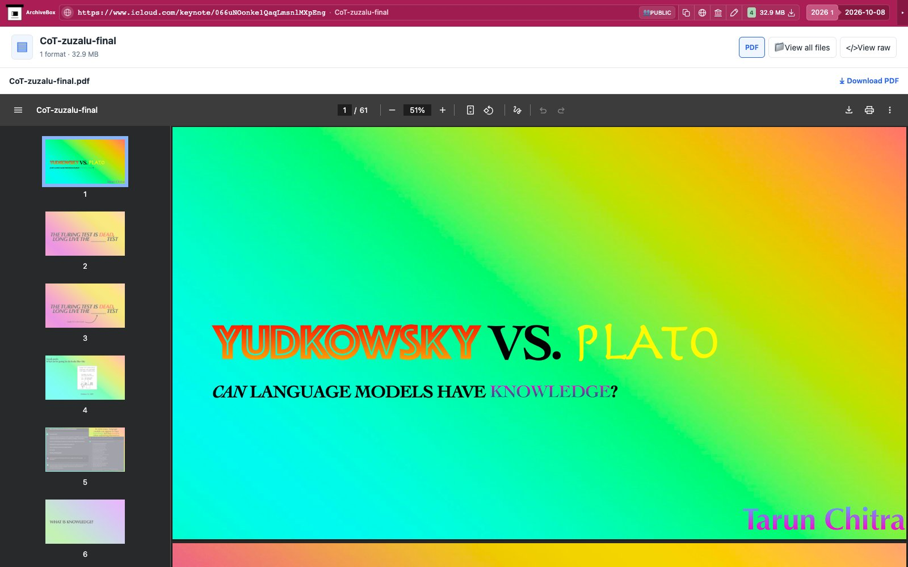

# iWork

Uses one snapshot hook to export public Keynote, Pages and Numbers documents through the attached Chrome session's actual Tools → Download a Copy → PDF controls. English UI labels are currently required. First-time guest onboarding uses the nickname `ArchiveBox`, then closes Current Participants before opening export controls. The hook does not edit the document. No browser launch, navigation, new tab, API key, OAuth setup, or new dependency is added.

Outputs, when the provider completes its download, use the shared `downloads.json` manifest and local `files/` explorer. Enabled by default. Configuration is limited to `IWORK_ENABLED` and `IWORK_TIMEOUT` (seconds, default 120, with `TIMEOUT` fallback).

Real public fixtures cover all three apps:

- [CoT-zuzalu-final](https://www.icloud.com/keynote/066uNOonke1QaqLmsnlMXpEng), linked from [Iframely's Keynote example](https://iframely.com/domains/apple-keynote): 61-page PDF.
- [Protocole Raman](https://www.icloud.com/pages/0aI0WdI93gupdpSgzGNwu90Pw#Protocole_Raman), published by the [author's teaching repository](https://github.com/dccote/Enseignement/blob/master/Protocols/Raman/README.md): 21-page Pages protocol.
- [NIO-dependency-check](https://www.icloud.com/numbers/049dkCvCOid9P8S0UxtCGE3iA#NIO-dependency-check), published by [Swift Package Index](https://github.com/SwiftPackageIndex/nio-dependency-analysis/blob/6d12abc913c18d7c1ff5a3f4cedeb1a80b854f14/README.md): one tall Numbers PDF with 298 package rows and the compatibility summary.

Tests execute the real Chrome lifecycle and hook, checking original filenames, PDF titles, page-tree counts, signatures, EOF, byte lengths and manifest hashes. Native Apple/Office formats, signed-in documents and private shares remain unverified.

See [live test evidence](tests/RESULTS.md). Run `uv run pytest abx_plugins/plugins/iwork/tests/test_iwork.py -q` with real Chrome prerequisites.
The 61-slide fixture needed about 70 seconds for Apple's export queue and rendering. The test uses `IWORK_TIMEOUT=120`, the documented plugin default, rather than inheriting the Chrome test environment's general 60-second timeout. Actual HTTP 200 export status responses progressed through `SCHEDULED_FOR_DOWNLOAD`, `SENT_TO_ACTIVEMQ`, and `PENDING` before the file was generated.

Real public capture replayed through ArchiveBox's normal file browser:

[Tablet](tests/replay-tablet.jpg) · [Mobile](tests/replay-mobile.jpg).

The hook attaches to Chrome before checking original/current document URLs and
waiting for navigation. Ordinary provider homepages return `noresults` without
provider selector waits or downloads. Identifiable document navigation and
export errors remain `failed`.

ArchiveBox previews the saved PDF directly and keeps that PDF available through Download. Nested collections or duplicate formats use the file explorer.
