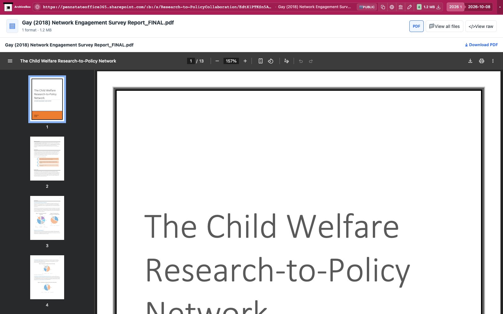

# Microsoft 365

Saves native SharePoint file previews using their actual Download control, and
original Word, Excel, and PowerPoint files referenced by the Office web
viewer's `src` parameter (`view.officeapps.live.com/op/view.aspx` and
`/op/embed.aspx`). The snapshot hook first attaches to the existing
Chrome target and checks the original/current URLs before waiting for navigation.
It downloads the original through
Chrome's authenticated resource stream; no separate HTTP client, OAuth setup,
new tab, or extra dependency. Unrelated pages return `noresults` immediately.

Produces `downloads.json` and the original in `files/`, with sizes and SHA-256
hashes. Checks OpenXML ZIP or legacy Office compound-file signatures and rejects
HTML/login responses. Outputs use the existing embedded-media stack.
Configuration (enabled by default): `MICROSOFT365_ENABLED` and `MICROSOFT365_TIMEOUT` (120 seconds,
with `TIMEOUT` fallback).

Verified with the public CPUC Word document
[551722326.docx in Office viewer](https://view.officeapps.live.com/op/view.aspx?src=https%3A%2F%2Fdocs.cpuc.ca.gov%2FPublishedDocs%2FPublished%2FG000%2FM551%2FK722%2F551722326.docx),
the 55-page decision approving partial recovery of PG&E's 2020 vegetation
management costs. The original ZIP CRC, Word XML content, byte length, and hash
are asserted by `uv run pytest -xq abx_plugins/plugins/microsoft365/tests`.

Native SharePoint file preview capture is also verified with the public
[Gay 2018 network survey report](https://pennstateoffice365.sharepoint.com/:b:/s/Research-to-PolicyCollaboration/EdtX1PTKSn5Apst-a_IKjIYBiP156uATgWctqeH0DK0v1A?e=mCHpWq),
linked by a [Cambridge research paper](https://www.cambridge.org/core/services/aop-cambridge-core/content/view/AF101B4FBD380CF69EE702025A5C9BD0/S0954579424000270a.pdf/div-class-title-shifting-the-paradigm-of-research-to-policy-impact-infrastructure-for-improving-researcher-engagement-and-collective-action-div.pdf).
The hook captures the Download button through the existing Chrome download
stream. A SharePoint or Office URL redirected to an authorization page produces
`skipped` when the redirect reaches a known Microsoft login host. Actual
document navigation, download and content-validation errors produce `failed`.
Office viewer pages without a valid supported HTTP document source, ordinary
tenant sites and marketing/login homepages return `noresults` without provider
selector waits or downloads.

Office editor conversions to PDF/CSV, native editor conversions and folders
are unverified and are not claimed. Public Excel/PowerPoint and legacy-file formats are
recognized by this same viewer source flow but still need independent live
fixtures.

Real public capture replayed through ArchiveBox's normal file browser:

[Tablet](tests/replay-tablet.jpg) · [Mobile](tests/replay-mobile.jpg).

ArchiveBox shows document-format controls and uses its built-in PDF preview for saved PDFs. Office originals remain downloadable; formats without a saved preview companion offer Download and View all files. Nested collections or duplicate formats use the file explorer.
