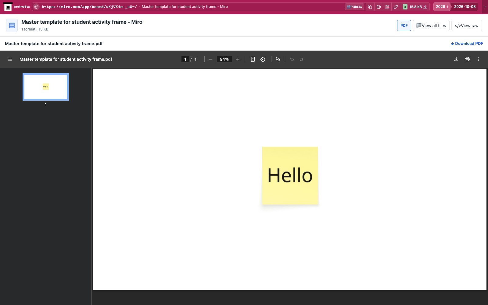

# Miro

Exports accessible Miro boards as PDF using an authorized Chrome session.
If the same session exposes
Download board backup, also save its editable `.rtb` backup. Miro restricts
backups to paid-team owners/co-owners or authorized Enterprise content admins;
PDF export can still work when a native backup is unavailable.

[Provider backup documentation](https://help.miro.com/hc/en-us/articles/360017572774-How-to-save-board-backup).
The public [workshop board](https://miro.com/app/board/uXjVK4c-_uU=/) was exported
with an authorized signed-in session. Its PDF contains the actual yellow
“Hello” sticky note. Native `.rtb` export remains unverified because this public
board does not grant that permission. Anonymous captures report a `skipped`
sign-in prerequisite with exit code 0. An explicitly disabled PDF export is also
`skipped` when no native backup was captured; an available backup is preserved.
Missing controls, loading/network failures and invalid exports remain failures.

The hook attaches to the snapshot's Chrome target and checks the requested and
attached URLs before waiting for navigation. Unrelated pages return `noresults`
even when their navigation failed. Recognizable boards still require successful
navigation before opening the existing export menus. The hook does not launch
a browser, open a tab, navigate, or request API keys.

`MIRO_ENABLED` defaults to true; set it false to disable extraction.
`MIRO_TIMEOUT` bounds the operation (120 seconds, with `TIMEOUT` fallback).
Saved files live under `miro/files/`; `downloads.json`
records paths, formats, sizes and SHA-256 hashes. ArchiveBox offers format buttons and direct previews.

```bash
AUTH_STORAGE_FILE=/path/to/authorized-persona.json CHROME_HEADLESS=false \
  uv run abx-dl dl --plugins=miro 'https://miro.com/app/board/uXjVK4c-_uU=/'
```

The authenticated acceptance test requires `AUTH_STORAGE_FILE` and uses headed
Chrome. Install Poppler's `pdfimages` for its actual exported-frame content check.
Anonymous tests explicitly clear inherited authentication. Run both with:

```bash
AUTH_STORAGE_FILE=/path/to/authorized-persona.json \
  uv run pytest abx_plugins/plugins/miro/tests -q
```

See `tests/RESULTS.md` for recorded evidence. The gallery recipe needs that same
authorized session to produce its PDF.

Real public capture replayed through ArchiveBox:



[Tablet](tests/replay-tablet.jpg) · [Mobile](tests/replay-mobile.jpg).

ArchiveBox previews the saved PDF directly. When an editable RTB backup is available, selecting it preserves Download of that original and uses its PDF companion for preview. Nested collections or duplicate formats use the file explorer.
