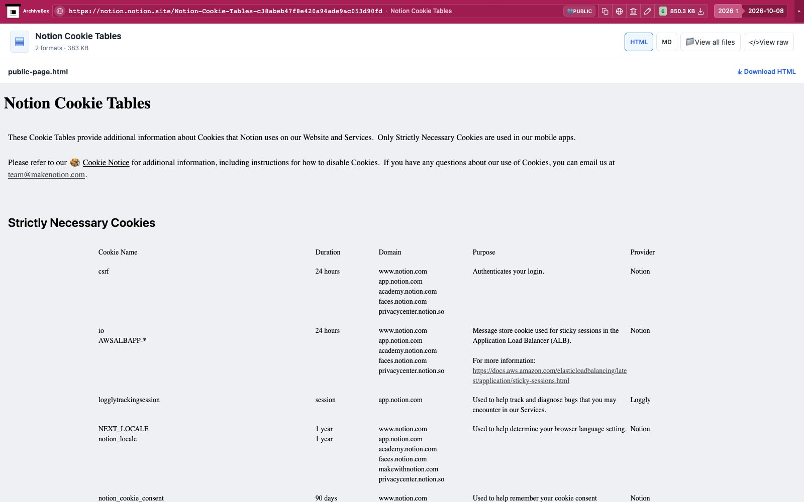

# Notion

Saves the rendered public Notion page as `files/public-page.html`, then uses the
existing Defuddle converter to produce `files/public-page.md`. `downloads.json`
records the title, file sizes, and SHA256 hashes. Uses the existing Chrome session.

After attaching to Chrome, the hook recognizes document URLs by their page ID,
or a published `notion.site` subdomain root with the actual page-content marker.
Ordinary Notion product, help, pricing, and home pages return `noresults`.

These are saved public-page artifacts, not Notion's native workspace export.
The current public page is captured; linked subpages, hidden toggle content,
database views not loaded in the browser, and remote media are not recursively
downloaded. No private API, account creation, or untested authenticated export
branch is used.

Configure `NOTION_ENABLED` (default true) and `NOTION_TIMEOUT` (seconds, default
120, with `TIMEOUT` fallback). Disabled capture returns `skipped`; unrelated
pages return `noresults` after attachment. Recognized-page navigation, content
capture and conversion errors remain `failed`.

The public fixture is Notion's own
[Cookie Tables](https://notion.notion.site/Notion-Cookie-Tables-c38abeb47f8e420a94ade9ac053d90fd).
Its anonymous More actions menu has no Export control. The live test checks real
headings, links, and cookie-table rows in both saved formats.

```console
uv run pytest abx_plugins/plugins/notion/tests/test_notion.py -q
```

The saved HTML preserves the public page's four tables. The saved Markdown also
contains the headings, links and table rows, but ArchiveBox's Markdown renderer
displays its pipe rows as paragraphs. The HTML output preserves the table layout.

Real public capture replayed through ArchiveBox's normal file browser:



[Tablet](tests/replay-tablet.jpg) · [Mobile](tests/replay-mobile.jpg).

ArchiveBox defaults to the saved HTML preview, preserving the table layout. Format buttons select the HTML or Markdown original; Download retrieves that selected file. Nested collections or duplicate formats use the file explorer.
