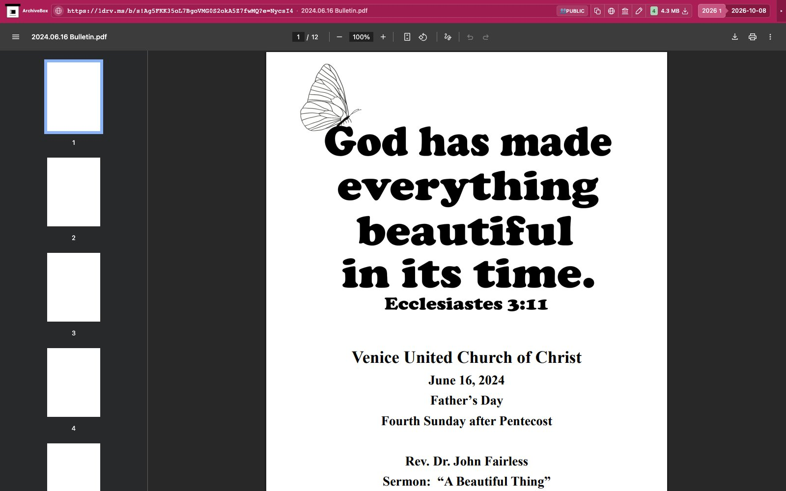

# OneDrive

Downloads original OneDrive Personal shared files from the snapshot's existing
Chrome session. One snapshot hook attaches to the snapshot target first, recognizes
OneDrive and `1drv.ms` shares, then uses the share-scoped content endpoint through
Chrome's authenticated resource-stream helper. Public share links carry their
own permission; no Graph app, OAuth setup, token, new browser, or dependency is
required. Unrelated pages return `noresults` without provider requests or waits.

Outputs: `downloads.json` and originals under `files/`, including filenames,
byte sizes, and SHA-256 hashes. The provider's attachment filename is preserved;
PDF signatures are checked. The existing embedded-media file explorer renders
saved files. Configuration (enabled by default): `ONEDRIVE_ENABLED` and `ONEDRIVE_TIMEOUT` (120 seconds,
with `TIMEOUT` fallback). Folder ZIP downloads, business SharePoint shares, and
password-protected shares are not implemented or claimed.

Verified real sources:

- [2024.06.16 Bulletin.pdf](https://1drv.ms/b/s!Ag5FKK35oL7BgoVMG0S2okA5Z7fwMQ?e=NycsI4),
  published as a sample bulletin in VUCC's [church profile](https://opportunities.ucc.org/CustomerFTP/6337/Attachments/VUCC%20Church%20Profile.pdf).
- [Conditional formatting Excel sample](https://1drv.ms/x/s!AtWnsymKn5hRiD8rrKYuHTlatez2?e=7F03hJ),
  published in [Microsoft Q&A](https://learn.microsoft.com/en-us/answers/questions/5092754/how-to-apply-conditional-formatting-using-vba).

Run `uv run pytest -xq abx_plugins/plugins/onedrive/tests`. Both the PDF original
and Excel original pass real Chrome lifecycle and hook CLI tests. Excel file
ZIP CRC and workbook/worksheet XML are verified.

Real public capture replayed through ArchiveBox's normal file browser:

[Tablet](tests/replay-tablet.jpg) · [Mobile](tests/replay-mobile.jpg).

The hook attaches to Chrome before checking original/current document URLs and
waiting for navigation. Ordinary provider homepages return `noresults` without
provider selector waits or downloads. Identifiable document navigation and
export errors remain `failed`.
Explicit OneDrive share redirects to recognized account login pages return `skipped`.
