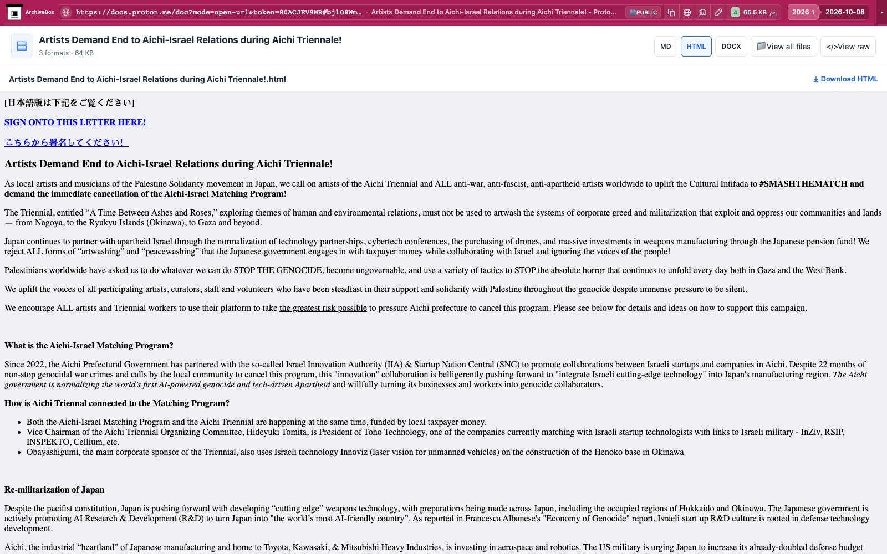

# Proton Docs

Exports an accessible Proton Docs document through the existing Chrome tab using the document menu. Saves Markdown, HTML, and DOCX exports in `files/`, with sizes and SHA-256 hashes in `downloads.json`. ArchiveBox uses its existing document viewers for replay.

One snapshot hook attaches to Chrome, checks the requested/current document URLs,
and returns `noresults` on unrelated pages before waiting for navigation. No
account credentials, API tokens, decryption implementation, or additional
packages are needed. Private and password-protected exports remain unverified;
document access must already be available in the existing browser session.

Configuration: `PROTONDOCS_ENABLED` (default true) and `PROTONDOCS_TIMEOUT`
(seconds, default 120, with `TIMEOUT` fallback). Disabled capture returns
`skipped`; identifiable document navigation/export errors remain `failed`.

The public test document is linked from [e-flux criticism](https://www.e-flux.com/criticism/6782330/aichi-triennale-2025-a-time-between-ashes-and-roses). It is third-party fixture content, and may change or be withdrawn.

Real public capture replayed through ArchiveBox's normal file browser:

[Tablet](tests/replay-tablet.jpg) · [Mobile](tests/replay-mobile.jpg).

ArchiveBox offers Markdown, HTML and Word format buttons. Saved HTML supplies the Word companion preview while Download retrieves the selected original. Nested collections or duplicate formats use the file explorer.
